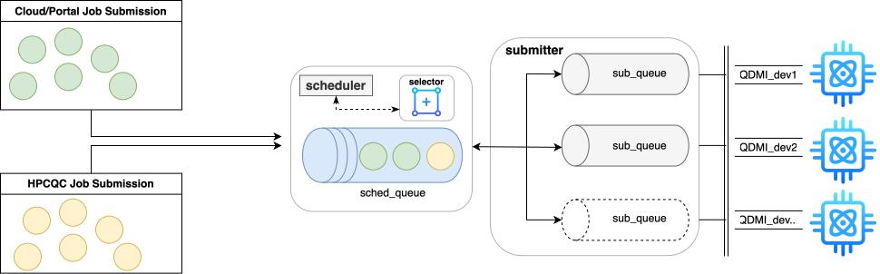

# MQSS Quantum Task Scheduler

> Part of the [Munich Quantum Software Stack (MQSS)](https://github.com/Munich-Quantum-Software-Stack) — Apache License 2.0 with LLVM Exceptions

A dependency-free, header-driven C++20 task scheduler (`mqss::Scheduler<TaskType>`) for dispatching quantum circuits to quantum hardware devices via [QDMI](https://github.com/Munich-Quantum-Software-Stack/QDMI). Any task type exposing `task_id()`/`priority()` works — the library itself has no coupling to a specific task struct, compiler pipeline, or logging framework.



---

## Table of Contents

- [Architecture](#architecture)
- [Project Structure](#project-structure)
- [Build Instructions](#build-instructions)
- [Running Tests](#running-tests)
- [Examples](#examples)
- [Scheduling Policies](#scheduling-policies)
- [License](#license)

---

## Architecture

`Scheduler<TaskType>` is constrained by the `Schedulable` concept (`task_id()`, `priority()`) and, optionally, `SizedSchedulable` (`n_qbits()`, used only by the `Backfilling` policy). It queues tasks (`scheduleTask`/`scheduleTasks`) and dispatches them one at a time (`getNextReadyTask`) according to a `SchedulingPolicy` fixed at construction — see [Scheduling Policies](#scheduling-policies).

`include/scheduler/quantum_task.hpp`'s `mqss::QuantumTask` is a lightweight example task type (mirroring the MQSS protocol's `QuantumTask` message field-for-field) used to exercise the scheduler in tests and examples. QDMI/LLVM/submitter only enter the picture at the *example* level (`examples/qrm-sscheduler/`), where a scheduled task actually gets submitted to a device — the scheduler library itself never touches them.

## Project Structure

```
scheduler/
├── CMakeLists.txt
├── cmake/                          # Find*.cmake modules for build-time dependencies
├── include/scheduler/
│   ├── scheduler.hpp               # Scheduler<TaskType>, Schedulable/SizedSchedulable, SchedulingPolicy
│   ├── scheduler.tpp               # Template method bodies
│   └── quantum_task.hpp            # mqss::QuantumTask - example Schedulable task type
├── src/
│   └── scheduler.cpp               # Explicit template instantiation for mqss::QuantumTask
├── tests/
│   └── gtest_scheduler.cpp         # Example-based + property-based tests, one per policy
├── examples/
│   └── qrm-sscheduler/             # gRPC ingress -> Scheduler -> QDMI submission pipeline
├── external/
│   ├── clone.sh                    # Clone QDMI/QInfo/submitter sources
│   ├── build.sh                    # Build and install them (+ per-alias QDMI device variants)
│   ├── FakeQDMI-Device-Example/    # Bundled C++ QDMI client binding
│   ├── selector/                   # Python-based device/pass selector (separate subproject)
│   └── installed/                  # Shared install prefix (created by build.sh)
├── dev-container/                  # docker compose dev environment + Slurm testbed
└── slurm-spank-plugins/            # SPANK plugins for Slurm-based QC access (IQM, MQSS)
```

---

## Build Instructions

Building `Scheduler` itself needs nothing beyond a C++20 compiler. `external/`'s dependencies
(QDMI/QInfo/submitter/LLVM) are only required because `CMakeLists.txt` currently also wires up
the example/submission toolchain alongside it.

### 1. Clone and build external dependencies

```bash
cd external
bash clone.sh    # QDMI v1.3.2, QInfo (develop), submitter (minh/ssintegrat)
bash build.sh    # installs everything under external/installed/
```

### 2. Build the scheduler

```bash
source examples/export_env_vars.sh
mkdir -p build && cd build
cmake .. -DCMAKE_BUILD_TYPE=Release
make -j$(nproc)
make install
```

---

## Running Tests

```bash
cd build
ctest --output-on-failure
```

`gtest_scheduler` needs nothing but GoogleTest — no QDMI/LLVM or extra environment setup required.

---

## Examples

```bash
source examples/export_env_vars.sh
cd examples/qrm-sscheduler
make proto && make
make run
```

See [`examples/qrm-sscheduler/Readme.md`](examples/qrm-sscheduler/Readme.md) for the full
gRPC → `Scheduler` → QDMI → Aer pipeline, including how to submit a real circuit and verify
the result.

---

## Scheduling Policies

| Policy | Description |
|--------|-------------|
| `FirstInFirstOut` | Dispatches tasks in arrival order |
| `PriorityBased` | Dispatches the highest-priority task first; ties keep arrival order |
| `RoundRobin` | Cycles dispatch across `task_id() % numLanes` lanes, so no lane's backlog starves the others |
| `Backfilling` | Skips a queued task that doesn't fit `setAvailableQubits()` in favor of a smaller one that does |
| `MixNMulti` | Dispatches by `priority() + agingWeight × waitTime`, so a long-waiting low-priority task eventually outranks a fresh high-priority one |

---

## License

Apache License 2.0 with LLVM Exceptions — see [LICENSE](https://llvm.org/LICENSE.txt).
