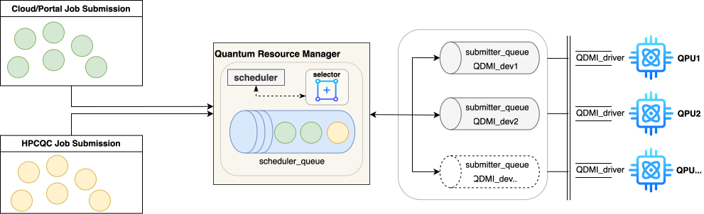

# MQSS Quantum Task Scheduler

> Part of the [Munich Quantum Software Stack (MQSS)](https://github.com/Munich-Quantum-Software-Stack) — Apache License 2.0 with LLVM Exceptions

The **MQSS Quantum Task Scheduler** manages the dispatch of quantum circuits to quantum hardware devices. It integrates device selection, queue management, and scheduling algorithms into a unified C++ library that sits between user-submitted quantum jobs and the underlying QDMI device layer.



---

## Table of Contents

- [Architecture](#architecture)
- [Project Structure](#project-structure)
- [Dependencies](#dependencies)
- [Build Instructions](#build-instructions)
- [Running Tests](#running-tests)
- [Examples](#examples)
- [Device Selector](#device-selector)
- [Scheduling Algorithms](#scheduling-algorithms)

---

## Architecture

The scheduler is composed of three core components:

| Component | Description |
|-----------|-------------|
| **Queue** | `SchedulerQueue` observes `SubmitterQueue`s from the [submitter](https://github.com/Munich-Quantum-Software-Stack/submitter) library and manages pending jobs |
| **Selector** | Chooses a target quantum device based on circuit characteristics using ML models or heuristics |
| **Scheduler** | Applies a scheduling algorithm to order and dispatch jobs from queues to devices via QDMI |

The library links against **LLVM** (for circuit IR parsing/optimization), **QDMI** (device interface), **QInfo** (device property queries), and the **submitter** (job lifecycle management).

---

## Project Structure

```
scheduler/
├── CMakeLists.txt
├── cmake/                          # Find*.cmake modules for all dependencies
├── include/scheduler/
│   ├── scheduler.hpp
│   ├── queue/
│   └── utils/
├── src/
│   ├── scheduler.cpp
│   ├── queue/queue.cpp
│   ├── utils/predictor.cpp
│   └── rl-scheduler-agent/         # RL-based scheduling agent (to be updated)
├── selector/                       # Python-based device selector (to be updated)
│   ├── src/
│   └── data/trained_models/
├── tests/
│   ├── CMakeLists.txt
│   └── gtest_scheduler.cpp
├── examples/
│   ├── export_env_vars.sh          # Runtime environment setup
│   ├── single-mpi-qcscheduler/     # Single MPI process example
│   └── multi-mpi-qcscheduler/      # Multi MPI process example
├── dependencies/
│   ├── clone.sh                    # Clone external dependency sources
│   ├── build.sh                    # Build and install all dependencies
│   ├── FakeQDMI-Device-Example/    # Bundled C++ QDMI binding
│   └── installed/                  # Shared install prefix (created by build.sh)
├── build/
│   └── export_mqss_envs.sh         # Build environment setup
└── figures/
```

---

## Dependencies

### External (fetched by `clone.sh`)

| Package | Repository | Version |
|---------|-----------|---------|
| [QDMI](https://github.com/Munich-Quantum-Software-Stack/QDMI) | Munich-Quantum-Software-Stack/QDMI | `v1.1.0` |
| [QInfo](https://github.com/Munich-Quantum-Software-Stack/QInfo) | Munich-Quantum-Software-Stack/QInfo | `develop` |
| [submitter](https://github.com/Munich-Quantum-Software-Stack/submitter) | Munich-Quantum-Software-Stack/submitter | `minh/ssintegrat` |

### Bundled

| Package | Location | Description |
|---------|----------|-------------|
| FakeQDMI-Device-Example | `dependencies/FakeQDMI-Device-Example/` | C++ QDMI session/device binding |

### Pre-built (not managed here)

| Package | Notes |
|---------|-------|
| LLVM | Expected at `/home/admin/shared/dependencies/installed`; override with `LLVM_ROOT` |
| OpenMPI | Required for examples; expected at `/usr/lib64/openmpi/` |
| GTest | Fetched automatically by CMake via `ExternalDependencies.cmake` |

---

## Build Instructions

### 1. Clone dependency sources

```bash
cd dependencies
bash clone.sh
```

To refresh sources to latest commits:
```bash
bash clone.sh --update
```

### 2. Build and install dependencies

```bash
bash build.sh
# Override LLVM location or parallelism if needed:
LLVM_ROOT=/path/to/llvm bash build.sh --jobs 8
# Force rebuild of all packages:
bash build.sh --force
```

This builds in order `QDMI → FakeQDMI-Device-Example → QInfo → submitter` and installs everything under `dependencies/installed/`.

### 3. Build the scheduler

```bash
source build/export_mqss_envs.sh

mkdir -p build && cd build
cmake .. -DCMAKE_BUILD_TYPE=Release
make -j$(nproc)
make install
```

---

## Examples

Set up the runtime environment first:

```bash
source examples/export_env_vars.sh
```

### Single-process MPI scheduler

```bash
cd examples/single-mpi-qcscheduler
make
make run        # mpirun -np 3 ./single_mpi_qcscheduler
```

### Multi-process MPI scheduler

```bash
cd examples/multi-mpi-qcscheduler
make
make run_mqss_scheduler   # starts the scheduler process
make run_endusers         # starts the end-user process
```

---

## Scheduling Algorithms

| Algorithm | Description |
|-----------|-------------|
| Backfilling | Fills idle device slots with smaller jobs that fit within reserved windows |
| Round Robin | Distributes jobs evenly across available devices in rotation |

---

## License

Apache License 2.0 with LLVM Exceptions — reffered to [LICENSE](https://github.com/Munich-Quantum-Software-Stack/QDMI/blob/develop/LICENSE).
