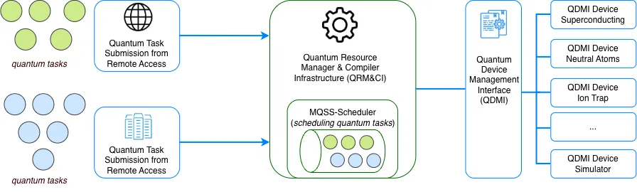

<!----------------------------------------------------------------------------
Copyright (c) 2024 - 2026 Munich Quantum Software Stack
All rights reserved.

Licensed under the Apache License v2.0 with LLVM Exceptions (the "License");
you may not use this file except in compliance with the License.
You may obtain a copy of the License at

https://llvm.org/LICENSE.txt

Unless required by applicable law or agreed to in writing, software
distributed under the License is distributed on an "AS IS" BASIS, WITHOUT
WARRANTIES OR CONDITIONS OF ANY KIND, either express or implied. See the
License for the specific language governing permissions and limitations under
the License.

SPDX-License-Identifier: Apache-2.0 WITH LLVM-exception
--------------------------------------------------------------------------->

<p align="center">
  <picture>
    <source media="(prefers-color-scheme: dark)" srcset="docs/_static/mqss_logo_dark.svg" width="20%">
    
  </picture>
</p>

# MQSS Quantum Task Scheduler

<p align="center">
  <a href="https://munich-quantum-software-stack.github.io/MQSS-Scheduler/">
    
  </a>
  &nbsp;
  <a href="https://github.com/Munich-Quantum-Software-Stack/MQSS-Scheduler/actions/workflows/ci.yml">
    
  </a>
</p>

A dependency-free, header-driven C++20 task scheduler (`mqss::scheduler::Scheduler<TaskType>`) for
dispatching quantum circuits to quantum hardware devices. `TaskType` is constrained structurally by the Schedulable concept — any type exposing `task_id()`/`priority()` satisfies it; plug in your own task struct and the scheduler works unmodified.

## FAQ

### What is MQSS?

_MQSS_ stands for _Munich Quantum Software Stack_ and is a project of the _Munich Quantum Valley_
initiative. It is jointly developed by the _Munich Quantum Valley (MQV) gGmbH_, _Leibniz
Supercomputing Centre (LRZ)_, the _Chair for Design Automation (CDA)_, and the _Chair of Computer
Architecture and Parallel Systems (CAPS)_ at TUM. It provides a comprehensive compilation and
runtime infrastructure for on-premise and remote quantum devices, support for modern compilation and
optimization techniques, and enables both current and future high-level abstractions for quantum
programming. This stack is designed to be capable of deployment in a variety of scenarios via
flexible configuration options. This includes stand-alone scenarios for individual systems, cloud
access to a variety of devices, as well as tight integration into HPC environments supporting
quantum acceleration. Concrete instances of the _MQSS_ are deployed at the LRZ and MQV gGmbH,
providing unified access to all of their quantum devices through multiple compatible access paths.
This includes a web portal, command line access via web credentials, as well as the option for
hybrid access with tight integration with HPC systems. It facilitates the connection between
end-users and quantum computing platforms by its integration within HPC infrastructures, such as
those found at the LRZ.

### Where is the code?

The code is publicly available and hosted on GitHub at
[github.com/Munich-Quantum-Software-Stack/MQSS-Scheduler](https://github.com/Munich-Quantum-Software-Stack/MQSS-Scheduler).

### Under which license is the MQSS Quantum Task Scheduler released?

The **MQSS Quantum Task Scheduler** is released under the Apache License v2.0 with LLVM Exceptions.
See [LICENSE](LICENSE) for more information. Any contribution to the project is assumed to be under
the same license.

## Architecture



`Scheduler<TaskType>` is constrained by the `Schedulable` concept (`task_id()`, `priority()`). It queues tasks
(`scheduleTask`/`scheduleTasks`) and dispatches them (`getNextReadyTask`) according to
a `SchedulingPolicy` fixed at construction — see [Scheduling Policies](#scheduling-policies).

`include/scheduler/quantum_task.hpp`'s `mqss::scheduler::QuantumTask` is a lightweight example task
type (mirroring the MQSS protocol's `QuantumTask` message) used to exercise the
scheduler in tests and examples. QDMI/LLVM/submitter enter the picture of quantum resource manager at the _example_
(`examples/qrm-sscheduler/`), where a scheduled task actually gets submitted to a device.

## Requirements

- CMake ≥ 3.19, a C++20-capable compiler
- GoogleTest, fetched automatically when building the test suite (see
  [cmake/ExternalDependencies.cmake](cmake/ExternalDependencies.cmake))
- Doxygen + Graphviz (optional, only needed to generate the API documentation)

`external/`'s dependencies (QDMI, QInfo, submitter, LLVM) are required to build the
example/submission toolchain (`examples/qrm-sscheduler/`) alongside the library.

## Building

### 1. Configure and build the scheduler

```bash
cmake -S . -B build -DCMAKE_BUILD_TYPE=Release -DBUILD_SCHEDULER_TESTS=ON
cmake --build build -j
```

### 2. (Optional) Build the example/submission toolchain

If you also need the gRPC ingress → Scheduler → QDMI submission pipeline
(`examples/qrm-sscheduler/`), clone and build the external dependencies first:

```bash
cd external
bash clone.sh    # QDMI, QInfo, submitter
bash build.sh    # compile and install the libraries
```

See [Getting Started](docs/getting-started.md) for the full step-by-step guide.

## Running Tests

```bash
ctest --test-dir build --output-on-failure
```

## Examples

```bash
source examples/export_env_vars.sh
cd examples/qrm-sscheduler
make proto && make
make run
```

See [`examples/qrm-sscheduler/Readme.md`](examples/qrm-sscheduler/Readme.md) for the full
gRPC → `Scheduler` → QDMI pipeline, including how to submit a quantum circuit and verify the
result.

## Contact

Please use the GitHub channels —
[issues](https://github.com/Munich-Quantum-Software-Stack/MQSS-Scheduler/issues) and
[pull requests](https://github.com/Munich-Quantum-Software-Stack/MQSS-Scheduler/pulls) —
to allow for open discussion.

## Contributing

See [contributing.md](contributing.md) and [code_of_conduct.md](code_of_conduct.md).

## License

This project is released under the Apache License v2.0 with LLVM Exceptions. See
[LICENSE](LICENSE) for more information. Any contribution to the project is assumed to be under
the same license.
